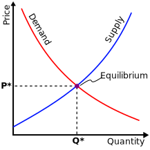

  
  

## Demand and Elasticity 

 [Notes](https://o365coloradoedu-my.sharepoint.com/:b:/g/personal/biba7086_colorado_edu/ERiItWt7hrxKmDcz9WLe2bUBkvq1xUhEPlx-HeNiFeBfzQ?e=BgurIJ)

## Supply and Equilibrium 

 [Notes](https://o365coloradoedu-my.sharepoint.com/:b:/g/personal/biba7086_colorado_edu/ERxJYed3r1tJslzMQi_V7BsBdgWY4cDxSLB6ZiDX5IARTA?e=aME85D)
 
 ## Surplus and Goverment Policy

 [Notes](https://o365coloradoedu-my.sharepoint.com/:b:/g/personal/biba7086_colorado_edu/EZ0OStnuJtBMoKXkSjn6iEQB_6qskfxYccsuaLoUkrqOKg?e=oDFFtS)
 
 ## Comparative Advantage and Taxes
 
  [Notes](https://o365coloradoedu-my.sharepoint.com/:b:/g/personal/biba7086_colorado_edu/Ecb5LSRKslRNldwWjIjVKPcBeMwTVoMcc7SLJfz8jwOylA?e=RMg9D3)
  
  ## Profit Maximization, Long Run and Short Run
  
    [Notes](https://o365coloradoedu-my.sharepoint.com/:b:/g/personal/biba7086_colorado_edu/EQShn80vxhtOm7Txj3vBbGQBYLZWoGwSy2XE7BjzSVS16A?e=m3hRgT)

<!--
##   Opportunity Cost and Trade
 - [Notes](https://o365coloradoedu-my.sharepoint.com/:b:/g/personal/biba7086_colorado_edu/EasJa1ShTxxOhxV_vIm924MBk8HNVHEX9pK3vlTui9loBg?e=O19ct0)
 - [Solutions](https://o365coloradoedu-my.sharepoint.com/:b:/g/personal/biba7086_colorado_edu/EV-CDWRM5FRAnP5sRuiF8QEBNQ5xsKSqEwY88p05aECLDw?e=xoa21J)

##    Supply and Demand
 - [Notes](https://o365coloradoedu-my.sharepoint.com/:b:/g/personal/biba7086_colorado_edu/ETTiRu12qUBJktKMiOSYLSIBK9xb-XCRS3Bhs-VPJIg-wQ?e=eGaCJC)
 - [Solutions](https://o365coloradoedu-my.sharepoint.com/:b:/g/personal/biba7086_colorado_edu/EZ9FeaF47yBBvvFt_ktVudUBo9-JW6_BU2slISV92bmjhQ?e=PaRwS7)
 
##   Equilibrium
 - [Notes](https://o365coloradoedu-my.sharepoint.com/:b:/g/personal/biba7086_colorado_edu/EYIRBoDp4DdEhHCue-9csrMBQYCbGGJ7wkQfztT1cFfHTA?e=PPovW6)
 - [Solutions](https://o365coloradoedu-my.sharepoint.com/:b:/g/personal/biba7086_colorado_edu/EeaEidKKU0ZNvXD5ZI8LnjoBVt7m_8jU6pQ3NyMAyMAAEg?e=xmOugk)
 
##   Consumer and Producer Surplus
 - [Notes](https://o365coloradoedu-my.sharepoint.com/:b:/g/personal/biba7086_colorado_edu/ERyf_v9VlDhLk0uGcULgsvsBWxVCk-2aW5TvPRDnV634YQ?e=CUcbnH)
 - [Solutions](https://o365coloradoedu-my.sharepoint.com/:b:/g/personal/biba7086_colorado_edu/EaxgrnGm3tpAscTOkOGfrtkBSXU9-ZWuEjMBp0wjJVVWUQ?e=O5mJr6)
 
##    Price Floor and Price Ceiling
 - [Notes](https://o365coloradoedu-my.sharepoint.com/:b:/g/personal/biba7086_colorado_edu/EUbisJeTkKBCnr_Jf0lUY8wBSrMyc0faCHAhclu6KOH-1w?e=hS03LJ)
 - [Solutions](https://o365coloradoedu-my.sharepoint.com/:b:/g/personal/biba7086_colorado_edu/EfJgA-BONjxCqvzlqFvvWoABelHk9nl-9jz7xPqdJ5D-HA?e=RvW8cz)
 
##   Midterm I Review
##     Elasticity
 - [Notes](https://o365coloradoedu-my.sharepoint.com/:b:/g/personal/biba7086_colorado_edu/ETLCW6j2iK9GhDUh6LI8LkgBTwUdkV4YdPGFnAhklwrXBw?e=VlsqVh)
 - [Solutions](https://o365coloradoedu-my.sharepoint.com/:b:/g/personal/biba7086_colorado_edu/ETUe9A04gdJNhWU1UP0JPj4BtPNLJZ6vRxcl30nk4_1d6g?e=BHBB9c)
 
##  Marginal Product and Marginal Cost
 - [Notes](https://o365coloradoedu-my.sharepoint.com/:b:/g/personal/biba7086_colorado_edu/EZ97a_h10gVDnEIgdHY047kBQxj3GbmQNx51aH2-xOBxAg?e=r0krVy)
 - [Solutions](https://o365coloradoedu-my.sharepoint.com/:b:/g/personal/biba7086_colorado_edu/EfdWLF9tYa5EiW3ZhyvUWacBcDjvEjiqS51G7QxXv57TMQ?e=Dgh1JW)
 
##    Profit Maximization and Perfect Compitition
 - [Notes](https://o365coloradoedu-my.sharepoint.com/:b:/g/personal/biba7086_colorado_edu/EUrRGix44atHpaQPCnOYW4QBBYMunkBGyOnsmDBdQd9G2A?e=F3223n)
 - [Solutions](https://o365coloradoedu-my.sharepoint.com/:b:/g/personal/biba7086_colorado_edu/EQkPh0OYtRBJgCU9v9L4p3AB2M8_X1rWINC5y1qQYBgXVQ?e=k6VA28)
 
##     Monopoly
 - [Notes](https://o365coloradoedu-my.sharepoint.com/:b:/g/personal/biba7086_colorado_edu/Ea3_53SP8qNNpbKd3BhUPvUB3eO-G4NgvQJUp_0AKT7KSQ?e=iDPX6L)
 - [Solutions](https://o365coloradoedu-my.sharepoint.com/:b:/g/personal/biba7086_colorado_edu/EXgAC-EYrZBMnx-1TtTKeAIBMVkwrSSiUtVNFcpzsNlgfQ?e=fwQEHc)
 
##   Monopolistic Competition + Midterm II Review
 - [Notes](https://o365coloradoedu-my.sharepoint.com/:b:/g/personal/biba7086_colorado_edu/EXBNnQQGIGtCi-Nq2O87Z-UBhPorCChRELlTcJN-BB6JIQ?e=dssFy5)
 - [Solutions](https://o365coloradoedu-my.sharepoint.com/:b:/g/personal/biba7086_colorado_edu/ETnEjb0utoVMnRzG6rPtX18B7mLFiZax2n_eigNbnGrLPg?e=qgSjBs)
 
##   Externalities and Public Goods + Final Exam Review
 - [Notes](https://o365coloradoedu-my.sharepoint.com/:b:/g/personal/biba7086_colorado_edu/EZKuHogzUvVFsX-jVtkVHbwBSRCtxLIL1zslkoI70gHD7g?e=VKqzQK)
 - [Solutions](https://o365coloradoedu-my.sharepoint.com/:b:/g/personal/biba7086_colorado_edu/ESEe8OEheOBNlLFDWgUyeocBR0vwDwCK2B7RA-7-TDAcdg?e=PK2hxR)
 
##    Taxes + Final Exam Review
 - [Notes](https://o365coloradoedu-my.sharepoint.com/:b:/g/personal/biba7086_colorado_edu/EV4WqKc_tghMjYJKeHCtPOkBGud8romHm9Vg0zvWYxg3TQ?e=gxF2yC)
 - [Solutions](https://o365coloradoedu-my.sharepoint.com/:b:/g/personal/biba7086_colorado_edu/EQVW1hU-E_NJrRlFp0bjUEwBE0gGZfSOeZbJHBb4QJwjyw?e=mbdW4J)
 

 

## Additional notes based on frequently asked questions
-   Does price-decrease increase Demand? No! [Demand vs Quantity Demanded](https://o365coloradoedu-my.sharepoint.com/:b:/g/personal/biba7086_colorado_edu/EXVT4dVOXXpJkQRgVqV4Nq8BDt_MogF-PPZjmUL4YRpiKw?e=jKzxBc) 
-   Which direction does demand or supply curve shift? [Shift in Curves](https://o365coloradoedu-my.sharepoint.com/:b:/g/personal/biba7086_colorado_edu/ESa1kQ19yVNMrvTWQ_Vl7WwB81wFFbT8YQUcAb_k3b-Leg?e=afOzgS) 
-   What if I forgot the direction of shifts in exam? [Finding shift](https://o365coloradoedu-my.sharepoint.com/:b:/g/personal/biba7086_colorado_edu/ETPB51MDI8JHmQu7Pj-mEJ0BYVVSqmaVkMx8u6S3EaBWLQ?e=eKenfk) 

-->

