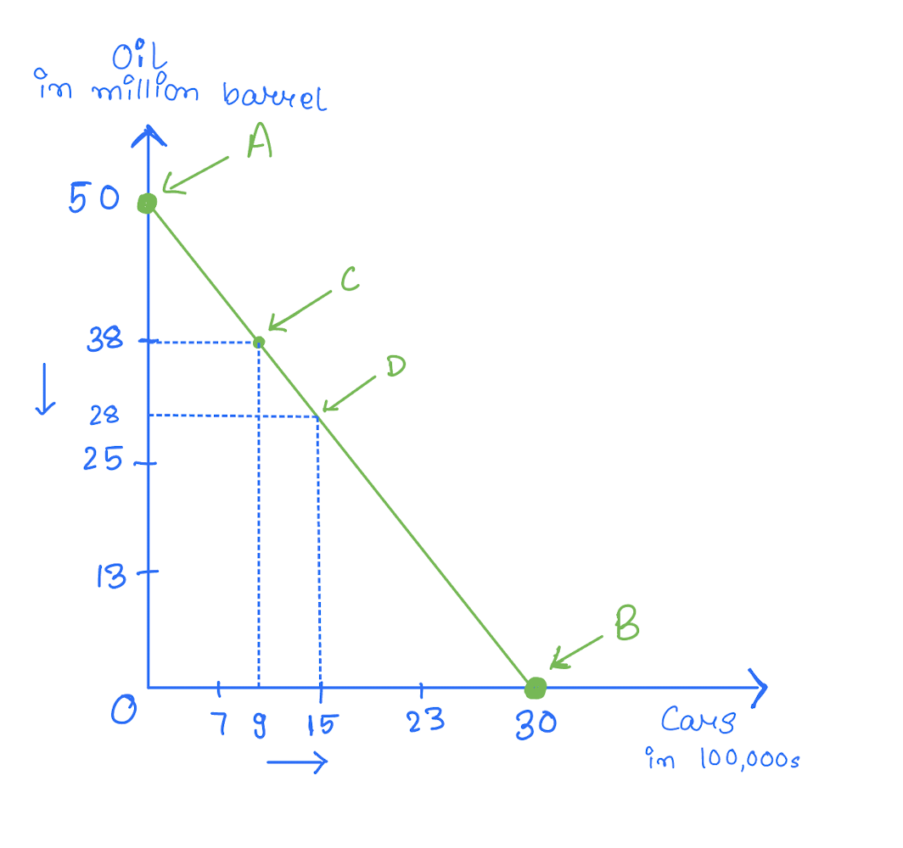

 The following notes are based on Mankiw, *Principles of Macroeconomics*, 10th Edition

---
## Thinking Like an Economist
- Economics is about trade-offs
- Opportunity Cost
  - Definition: It is defined as the value of the next best alternative. It is the value you forgo when you make a choice.
  
### Production Possibility Forntier (PPF)

- The following is the PPF for a country that only produces oil and cars. 

  

- Production efficiency means that there is no way to produce more of one good without producing less of other goods
- A: Amount of oil produced if the country only produces oil
- B: Amount of cards produced if the country only produces cars

### Oppoutunity cost and PPF

#### Question:  What is the opporunity cost of going from point C to D? 

  

Step 1: Equate production if the country only produced either of the good (i.e. $A=B$)

$$ 50 \text{ mil barrels of oil} = 30 \text{ hundred thousand cars}$$

Step 2: Since we are increasing the production of cars make the right hand side 1
$$ \frac{50}{30} \text{ mil barrels of oil} = 1 \text{ hundred thousand cars}$$

Step 3: Car production increases by $15-9=6$ so make the right hand side 6 by multiplying both sides by 6

$$ \frac{50}{30}*6 \text{ mil barrels of oil} = 6 \text{ hundred thousand cars} $$
$$ \Leftrightarrow 10 \text{ mil barrels of oil} = 6 \text{ hundred thousand cars} $$

So, moving from C to B requies giving up 10 mil barrels of oil. 

### Additional notes: 
- Economic growth results in the PPF shifting outwards
- Shape of PPF
    - If the PPF is a straight line the opporunity cost is constant
    - If the PPF is bowing outwards the opporunity cost in increasing
    - If the PPF is bowing inwards the opporunity cost in decreasing
### Positive statement vs Normative statement

- Positive statement - Statement that are testable
    - Example: The unempolyent rate is 4%
- Normative statement - Statement that are based on opinions
    - Example: The unemployment rate should be 0%

---
## Interdependence & Gains from Trade

### Comparative Advantage vs Absolute Advantage

- Absolute advantage
    - A country (individual) has an absolute advantage if it can produce more good or service than others
    - Absolute advantage has nothing to do with gains from trade 
- Comparative advantage
    - A country (individual) has an comparative advantage if it can produce a particular good or service with lower opportunity cost
    - In other words, they have to give up less
    - Gains from trade are based on comparative advantage

### Calcuating Comparative Advantage

Conside two countries that produce either Iphones or video games. The following table shows the number of people required to build one of either. Suppose that USA and China have 100 and 200 people available to work respectively. 

|           | Video Games      | iPhones  |
|-----------|-----------   |-----------   |
| USA       | 12           | 24           |
| China     | 8            | 32           |

#### Question: Which country has the comparative advantage in producing video games?

<button onclick="document.getElementById('solution').style.display='block'">Show Solution</button>

STEP 1: Equate production if the country only produced either of the good

- USA
$$ 12 * 100 \text{ Video Games} = 24 * 100\text{ iPhones}$$
- China
$$ 8 * 200 \text{ Video Game} = 32 * 200\text{ iPhones}$$

STEP 2: Since we are interested in the opprtunity cost of video Games, make the left hand side 1. 

- USA
$$ 1 \text{ Video Game} = \frac{24 * 100}{12*100}\text{ iPhones}$$
$$ \Leftrightarrow 1 \text{ Video Game} = 2 \text{ iPhones}$$
- China

$$ 1 \text{ Video Game} = \frac{32 * 200}{8*200}\text{ iPhones}$$
$$ \Leftrightarrow 1 \text{ Video Game} = 4 \text{ iPhones}$$

STEP 3: Find which country has the smaller opportunity cost (or who has to give up less). In this case it is the USA. So, USA has the comparative advantage in producing video games. 

Note: If you are trying to find which country has the comparative advantage in producing iPhones, step 1 and 3 are identical and you just have to make the right hand side 1 in step 2. 

### Gains from Trade 

Main idea: Trade allows countries to consume at a level in the PPF that is otherwise infeasible. This requires that each country only produce the good in which they have comparative advantage. 
See Chapter 3 Question 3 

---
## Application to International Trade

### Consumer and Producer Surplus 

  

$$\text{Total Surplus }=\text{ Consumer Surplus }+\text{ Producer Surplus }$$

To calcuate the numeric value for the surplus use the area of the triangle formula 
$\frac{1}{2} * \text{Base} * \text{Height}$

### Surplus and Gains from Trade when World Price $P_W$ is different than Domestic Price $P_D$

  

Things to note

|                        | **$P_W > P_D$** | **$P_W < P_D$** |
|:----------------------:|:----------:|:----------:|
| **Direction of Trade** |  Export   |  Imports   |
| **Consumer Surplus**   |   Falls    |   Rises    |
| **Producer Surplus**   |   Rises    |   Falls    |
| **Total Surplus**      |   Rises    |   Rises    |

### Tariffs

  

Things to note

- Tarrif causes the World Price $P_W$ to increase
- If the country was importing 
    - The new import is going to be reduced 
    - The consumer surplus is going to decrease but the producer surplus will increase 
    - There is Deadweight loss (DWL) from the traiffs

---
## Measuring a Nation's Income

### Gross Domestic Product (GDP)

GDP is the total value of all goods and services produced within a country. It is used to capture the overall health of the economy. 

It includes the following
- Goods and services produced legally in the country 
- Final good 
    - For example, a car the is sold to a consumer not intermediate goods such car engines or other body parts
- Year $X$ GDP only includes value procuded in year $X$ and not the value produced in year prior, regardless of when the good was consumed. 
- Tangible goods (like food, mountain bikes, beer) and intangible service (dry cleaning, concerts, haircuts)

GDP excludes
- Goods and services produced illegally or at home in the country
- Intermediate goods 
    - These are not incldued to avoid double counting. For example if you inlude both the final car and the car engines, you end up counting this value twice
- Value of goods produced in other year
- Goods that produced in another country but not imported

In short, GDP includes value the goverment can $accurately$ measure $within$ the $entire$ country in a $given$ $time$.

### 
The formula of GPD is 
$$ GDP = C + I + G + Ex - Im $$

where
- $C$ is consumption 
- $I$ is invesetment 
- $G$ is goverment expenditure 
- $Ex$ is the nation's export 
- $Im$ is the nation's import 

Notes about the components
- $C$ includes spending by households on good and service but excludes the purchase of the house iteself because it might be "produced" in a different year 
- $I$ includes spending on goods that will be used to produce future goods (like inventory) but excluded spending on financial assets
- $G$ includes spending on the goods and services purchased by the government but excludes tranfer of payments like unemployment insurance benefits
- $Ex$ increases GDP while $Im$ decreases GDP 

### Real vs Nominal GDP 
Nomial GDP is the total value of goods and service $not corrected$ for inflation while Real GDP is the value of goods and service $corrected$ for inflation.
- For base year Nomial GDP $=$ Real GDP

### GDP deflator and Inflation Rate

GDP deflator is given by 

$$ \text{GDP Deflator}=100 * \frac{\text{Nominal GDP}}{\text{Real GDP}} $$

The inflation rate between year $X$ and year $Y$ (where $X>Y$) is given by 
$$   \text{Inflation Rate}=100 * \frac{   \text{GDP Deflator at year X}- \text{GDP Deflator at year Y}  }{ \text{GDP Deflator at year Y} }  $$

Important: Please see the examples in the lecture slides to practice using these concepts. 

---
## Measuring Prices & Cost of Living

### Basket of Goods
The goverment wants to see how expensive things are getting in the economy every year. To do so in a standardized way, the BLS identifies a "basket of goods" a typical consumer buys and compares the total cost of this basket over time. (See [here](https://www.bls.gov/cpi/questions-and-answers.htm) for the things that are included in this basket)

### CPI and Inflation Rate
Once we find the total cost of a basket for different years, we can see how expensive things are getting using the Consumer Price Index (CPI) and Inflation rate. There are other measures but these are the most popular. 

The formula for CPI is 
$$CPI = \frac{\text{Basket Cost in Current Year}}{\text{Basket Cost in Base Year}}$$

The inflation rate between year $X$ and year $Y$ (where $X>Y$) is given by 
$$   \text{Inflation Rate}=100 * \frac{   \text{CPI in year X}- \text{CPI in year Y}  }{ \text{CPI in year Y} }  $$

See Chapter ... question ... for practice

### CPI vs GDP Deflator
In short, CPI measures how expensive things are getting for the $consumer$ and the GDP Deflator measures how expensive things are getting for the $producers$.

- Note that things that affect both the consumers and the producers are incldued in both measures. For example, rise in the price of textbook affects both consumers (consumer now buy less) and produces (sellers produce more due to rise in profit margins). So, it is included in both measures.

### Comparing Prices from different times

Comparing nominal dollar amounts across different times is not a fair comparasion because the value of these amounts differs. For example, the value of $100K$ wage in 2025 is not the same as the value of a $100K$ wage in 1980. To make a fair comparasion we need to convert prior year amounts to base year. 

Let $X$ be the base year and $Y$ be the prior year. The conversion formula is 

$$   \text{Amount in year $X$ dollars}= \text{Amount in year $Y$ dollars} * \frac{   \text{Price Index in $X$}  }{ \text{Price Index in $Y$ }}  $$

### Interest Rate

Interest rates are important because it determines the growth in value of your deposit. However, the actual interst rate on your saving might not be the stated nominal interest rate. This is because while nominal interest rate (for example, the rate given by your bank) might increase the value of your savings, the inflation rate will decrease this value through decrease in purchasing power. So, to find the rate the you actually face on your deposit use the following adjustment. 
The real interest rate is given by 
$$\text{Real Interest Rate} = \text{Nominal Interest Rate} - \text{Inflation Rate}$$

---
## Production & Economic Growth
---
## Savings, Investment & the Financial System
---
## Unemployment
---
## The Monetary System
---
## Money Growth & Inflation 
---
## Open-Economy Macro: The Basics
---
## Aggregate Demand & Aggregate Supply
---
## Monetary & Fiscal Policies
---
